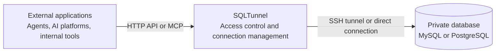

# SQLTunnel

[](https://hub.docker.com/r/nemoalex/sqltunnel)
[](https://hub.docker.com/r/nemoalex/sqltunnel/tags)

[English](README.md) | [中文](README.zh-CN.md) | [日本語](docs/readme/README.ja.md) | [한국어](docs/readme/README.ko.md) | [Français](docs/readme/README.fr.md) | [Deutsch](docs/readme/README.de.md)

SQLTunnel is a database access gateway that lets agents such as Codex, Claude Code, and Hermes, as well as Dify, automation platforms, and internal applications, query private databases with controlled permissions without exposing database ports directly.

Key capabilities:

- Supports MySQL and PostgreSQL through direct connections or SSH tunnels.
- Identifies callers with API keys and configures read/write access per client and db server.
- Supports SSH config, Host aliases, and ProxyJump.
- Provides an OpenAPI HTTP API and a Streamable HTTP MCP endpoint.
- Enforces row limits and timeouts; writes require explicit permission.

## How It Works



`gateway.yaml` contains three types of configuration:

- `dbServers`: database connection details.
- `sshServers`: reusable SSH connections.
- `clients`: external callers and their database permissions.

Database passwords and SSH private keys remain on the SQLTunnel server. External callers only need their own API key.

## Quick Start

### Run Directly

```bash
git clone https://github.com/NemoAlex/SQLTunnel.git
cd SQLTunnel
cp config/gateway.example.yaml config/gateway.yaml
npm install
npm run build
npm run start
```

### macOS Desktop App

The repository includes a compact Electron app: a small status window starts and stops the gateway and shows database/SSH connection state, while a separate settings window manages databases, tunnels, client grants, and global limits.

```bash
npm install
npm run desktop:dev  # Development mode
npm run dist:mac     # Build the Apple Silicon app, DMG, and ZIP
```

The desktop app always binds to `127.0.0.1` and stores its configuration at `~/Library/Application Support/sqltunnel/gateway.yaml` by default. Sign it with a Developer ID and notarize it before public distribution.

The service listens on `0.0.0.0:3000` by default. Override it with environment variables:

```bash
FASTIFY_HOST=127.0.0.1 FASTIFY_PORT=3001 npm run start
```

### Use the Docker Image

Use the published SQLTunnel image with Docker Compose:

```yaml
services:
  sqltunnel:
    image: nemoalex/sqltunnel:1.0.2
    container_name: sqltunnel
    restart: unless-stopped
    ports:
      - "3000:3000"
    volumes:
      - ./config:/app/config:ro
```

```bash
cp config/gateway.example.yaml config/gateway.yaml
docker compose up -d
```

### Build the Docker Image Locally

The repository's `compose.yaml` builds SQLTunnel from the local source code and starts the service:

```bash
docker compose up --build
```

## Configuration

SQLTunnel reads `config/gateway.yaml` by default. Start by copying `config/gateway.example.yaml`, then configure the following sections:

- `defaults`: optional global limits for returned rows, query and connection timeouts, and schema cache lifetime.
- `sshServers`: optional reusable SSH connections. Database servers can reference them by ID when a direct connection is not available.
- `dbServers`: MySQL or PostgreSQL connection details, optional SSH routing, and server-level limits.
- `clients`: API keys, database access grants, `read` or `write` permissions, and optional per-client limits.

See the **[configuration reference](docs/configuration.md)** for the complete YAML schema, field descriptions, defaults, SSH config support, ProxyJump examples, and permission behavior.

The recommended directory layout is:

```text
config/
  gateway.yaml
  gateway.example.yaml
  ssh/                 # Optional
    config             # Optional: SSH Host aliases, users, ports, ProxyJump, and other login details
    id_rsa             # Optional: private key required for key-based SSH login
```

Set `SQLTUNNEL_CONFIG=/path/to/gateway.yaml` to load a configuration file from another location. Relative `sshConfigPath` and `privateKeyPath` values are resolved from the directory containing `gateway.yaml`, so the layout above works both locally and when the entire `config` directory is mounted at `/app/config` in Docker.

`gateway.yaml` contains database passwords, client API keys, and possibly SSH credentials. Keep it out of version control, restrict its file permissions, and give each client only the database access and `read` or `write` permission it needs.

## OpenAPI

The OpenAPI document is available at `GET /openapi.json`. Business endpoints include:

- `POST /schema`: list databases or tables, or read a table schema.
- `POST /query`: execute an authorized and bounded SQL statement.

Requests authenticate with `Authorization: Bearer <SQLTUNNEL_API_KEY>`. See the [API reference](docs/api.md) for complete formats.

## MCP

The Streamable HTTP MCP endpoint is available at `POST /mcp` and provides these tools:

- `list_db_servers`
- `list_database_tables`
- `get_table_schema`
- `query_database`

MCP uses the same API keys, database permissions, row limits, and timeouts as OpenAPI. Use a read-only client and database account for agents, and expose `/mcp` through HTTPS for remote deployments.

Setup guides:

- [Dify](docs/dify.md)
- [Claude Code](docs/claude-code.md)
- [Codex](docs/codex.md)
- [Hermes](docs/hermes.md)

## Reference

- [Configuration reference](docs/configuration.md)
- [API reference](docs/api.md)
