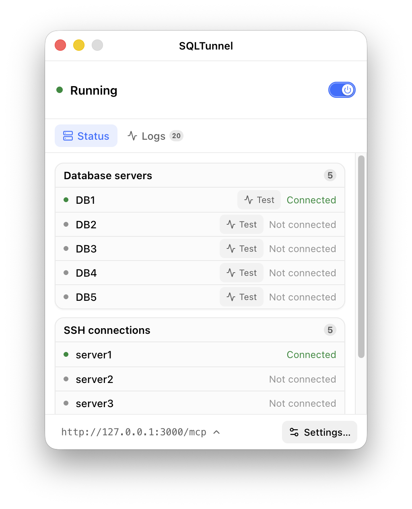
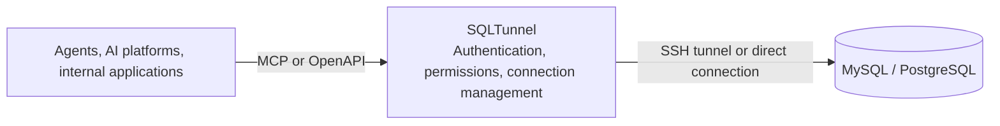

  

<h1 align="center">SQLTunnel</h1>

<strong>A controlled database gateway for agents, automation platforms, and internal applications</strong>

  
  

  <a href="README.md">English</a> |
  <a href="docs/readme/zh-CN/README.md">中文</a> |
  <a href="docs/readme/ja/README.md">日本語</a> |
  <a href="docs/readme/ko/README.md">한국어</a> |
  <a href="docs/readme/fr/README.md">Français</a> |
  <a href="docs/readme/de/README.md">Deutsch</a>

SQLTunnel lets Codex, Claude Code, Hermes, Dify, and internal applications access MySQL and PostgreSQL with controlled permissions, without exposing database ports directly.

## Key capabilities

- Supports MySQL and PostgreSQL through direct connections or SSH tunnels.
- Identifies callers with API keys and configures read/write access per client and database.
- Supports SSH Config, Host aliases, and ProxyJump.
- Provides an OpenAPI HTTP API and a Streamable HTTP MCP endpoint.
- Enforces row limits and timeouts; writes require explicit permission.

## Desktop app

The desktop app is available for macOS and Windows, bringing SQLTunnel configuration, operation, and monitoring into a graphical interface.

  

## Headless service

The headless edition uses the same gateway core and is designed for Docker, servers, and background deployments. It manages databases, SSH tunnels, and client permissions through `gateway.yaml`, and exposes the same MCP/OpenAPI interfaces as the desktop app.

- [Docker deployment](docs/readme/en/docker.md)
- [Configuration reference](docs/readme/en/configuration.md)

## How it works

SQLTunnel identifies callers with Bearer API keys, controls read/write access per client and database, and applies row, query, and connection limits. Database passwords and SSH private keys are never exposed to callers.

## Documentation

- [Docker deployment](docs/readme/en/docker.md)
- [Configuration reference](docs/readme/en/configuration.md)
- [API reference](docs/readme/en/api.md)
- [Dify](docs/readme/en/dify.md)
- [Claude Code](docs/readme/en/claude-code.md)
- [Codex](docs/readme/en/codex.md)
- [Hermes](docs/readme/en/hermes.md)
