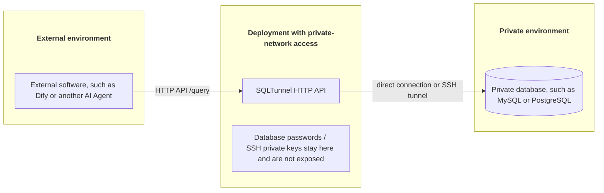

# SQLTunnel

[](https://hub.docker.com/r/nemoalex/sqltunnel)
[](https://hub.docker.com/r/nemoalex/sqltunnel/tags)

[Chinese](README.zh-CN.md)

SQLTunnel is a database access gateway for external applications that need to query databases reachable only from private networks.

It is designed for cases where databases live behind a firewall, inside a VPC, or behind a bastion host, while tools such as Dify, AI agents, automation platforms, or internal apps need controlled query access. SQLTunnel runs in an environment that can reach the database or SSH bastion, and exposes a small API to authorized clients. The database port does not need to be exposed directly.

SQLTunnel is especially useful for giving AI tools database query access:

- Identify callers with API keys.
- Authorize each client for specific db servers only.
- Configure read or write permission per client and per db server.
- Reach private databases through SSH tunnels.
- Read SSH config, including Host aliases and ProxyJump.
- Enforce query row limits and timeouts.
- Default to read-oriented access; writes require explicit permission.

## How It Works

Typical request path:



The configuration file defines three main objects:

- `dbServers`: databases that SQLTunnel can access.
- `sshServers`: reusable SSH tunnel entries, optionally backed by SSH config.
- `clients`: external callers and the db servers they are allowed to use.

External applications do not see database passwords or SSH private keys. They only receive their own API key and the db server ids they are allowed to query.

## Use Cases

SQLTunnel fits these scenarios:

- Dify or another AI tool needs to query a private database.
- A database must not expose a public port and is reachable only through a bastion host or SSH config.
- Multiple external applications need the same database access gateway with different permissions.
- Database credentials, SSH private keys, and bastion details should stay in server-side configuration.
- AI-generated SQL should be constrained by read/write permission, row limits, and timeouts.

SQLTunnel does not generate SQL and does not replace database auditing. Its role is to forward authorized query requests to the correct db server and enforce basic access controls.

## Quick Start

### Run Directly

```bash
git clone https://github.com/NemoAlex/SQLTunnel.git
cd SQLTunnel
cp config/gateway.example.yaml config/gateway.yaml
npm install
npm run build
npm run start
```

The service listens on `0.0.0.0:3000` by default. Override host and port with environment variables:

```bash
FASTIFY_HOST=127.0.0.1 FASTIFY_PORT=3001 npm run start
```

### Docker Compose

SQLTunnel is published on Docker Hub as `nemoalex/sqltunnel`:

```bash
docker pull nemoalex/sqltunnel:1.0.0
```

Create a Compose file that uses the Docker Hub image:

```yaml
services:
  sqltunnel:
    image: nemoalex/sqltunnel:1.0.0
    container_name: sqltunnel
    restart: unless-stopped
    ports:
      - "3000:3000"
    volumes:
      - ./config:/app/config:ro
```

Then start it:

```bash
cp config/gateway.example.yaml config/gateway.yaml
docker compose up -d
```

The repository's `compose.yaml` is intended for local development and builds `sqltunnel:local` from the local `Dockerfile`:

```bash
docker compose up --build
```

### Config Directory

Recommended structure:

```text
config/
  gateway.yaml
  gateway.example.yaml
  ssh/                 # Optional.
    config             # Optional. SSH Host aliases, users, ports, ProxyJump, and other login details.
    id_rsa             # Optional. Private key, only needed when you use key-based SSH login.
```

Recommended setup:

- Copy `config/gateway.example.yaml` to `config/gateway.yaml` and edit it for your environment.
- Use `config/ssh/` only when you want SQLTunnel to load SSH files from the mounted config directory.
- Put private keys such as `id_rsa` under `config/ssh/` only when the SSH server requires key-based login.
- Put an SSH config file under `config/ssh/config` when you want to describe SSH login details with Host aliases, ports, users, IdentityFile, or ProxyJump.
- Reference SSH files with paths relative to `gateway.yaml`, for example `sshConfigPath: ssh/config` and `privateKeyPath: ssh/id_rsa`.
- Mount the whole `config` directory into the container as `/app/config`; the default config path becomes `/app/config/gateway.yaml`.
- Keep API keys, database passwords, and SSH private keys in `config/gateway.yaml` or files under `config/ssh/`; external callers only need their own API key.

## Configuration

SQLTunnel reads `config/gateway.yaml` by default. You can override it with `SQLTUNNEL_CONFIG=/path/to/gateway.yaml`.

The configuration has three main sections:

- `sshServers`: reusable SSH tunnel entries, with support for `~/.ssh/config` and `ProxyJump`.
- `dbServers`: database servers, including database type, address, credentials, and optional SSH access.
- `clients`: API clients, their API keys, and the db servers each client may access.

Optional global defaults:

- `defaults.maxRows`: Default max rows. Default: `1000`.
- `defaults.queryTimeoutMs`: Default database query timeout. Default: `10000`.
- `defaults.connectTimeoutMs`: Default SSH tunnel and database connection timeout. Default: `10000`.

### SSH Servers

`sshServers` define reusable SSH tunnel entries. A db server references one with `sshServerId`.

```yaml
sshServers:
  - id: bastion-prod
    sshConfigPath: ssh/config
    host: db-prod
    port: 22
    username: deploy
    password: optional-password
    privateKeyPath: ssh/id_rsa
    passphrase: optional-key-passphrase
    idleTimeoutMs: 60000
```

Fields:

- `id`: Required. SSH server id used by `dbServers[].sshServerId`.
- `host`: Required. Real SSH host or a Host alias from SSH config.
- `sshConfigPath`: Optional. SSH config path. Relative paths are resolved from the directory containing `gateway.yaml`. If omitted, SQLTunnel reads the runtime user's `~/.ssh/config`.
- `port`: Optional. SSH port. Default: `22`.
- `username`: Optional. SSH username. Default: current runtime user.
- `password`: Optional. SSH password for password authentication.
- `privateKeyPath`: Optional. Private key path. Relative paths are resolved from the directory containing `gateway.yaml`. If omitted, SQLTunnel may use SSH config `IdentityFile` or common default private keys from the runtime user.
- `passphrase`: Optional. Passphrase for an encrypted private key.
- `idleTimeoutMs`: Optional. How long to keep an idle SSH connection open. Default: `60000`.
- `proxyJumps`: Optional. ProxyJump chain. In most cases, put ProxyJump in SSH config and SQLTunnel will read it from there.

Supported SSH config fields:

- `Host`
- `HostName`
- `User`
- `Port`
- `IdentityFile`
- `ProxyJump`

SQLTunnel only implements the SSH config fields listed above. Other OpenSSH options are ignored, including:

- `ProxyCommand`
- `Include`
- `HostKeyAlias`
- `LocalForward`
- `RemoteForward`
- `DynamicForward`

When `host` is a Host alias, SQLTunnel can fill in the real host, user, port, private key, and ProxyJump from SSH config.

Docker-friendly SSH config example:

```yaml
sshServers:
  - id: db-prod
    sshConfigPath: ssh/config
    host: db-prod
```

Matching SSH config:

```sshconfig
Host bastion-prod
  HostName bastion.example.com
  User deploy
  Port 22
  IdentityFile ~/.ssh/id_rsa

Host db-prod
  HostName 10.0.8.12
  User deploy
  ProxyJump bastion-prod
```

SQLTunnel reuses SSH connections by SSH server id. Each query opens a new forwarding channel. Idle SSH connections are closed after `idleTimeoutMs`.

Local runs use `SSH_AUTH_SOCK` when an ssh-agent is available. In Docker, mount the agent socket yourself if you want to use ssh-agent; otherwise configure a private key readable inside the container.

### DB Servers

`dbServers` define databases that SQLTunnel can access. Clients receive access by db server id.

```yaml
dbServers:
  - id: reporting-mysql
    type: mysql
    sshServerId: bastion-prod
    maxRows: 1000
    queryTimeoutMs: 10000
    connectTimeoutMs: 10000
    database:
      host: 127.0.0.1
      port: 3306
      user: app
      password: mysql-password
      database: app
```

Fields:

- `id`: Required. Db server id used by `clients[].dbServers[].serverId` and query request `dbServerId`.
- `type`: Required. Database type: `mysql` or `postgres`.
- `sshServerId`: Optional. References `sshServers[].id`. If omitted, SQLTunnel connects directly to the database.
- `maxRows`: Optional. Default max rows for this db server. If omitted, `defaults.maxRows` is used.
- `queryTimeoutMs`: Optional. Default database query timeout for this db server. If omitted, `defaults.queryTimeoutMs` is used.
- `connectTimeoutMs`: Optional. SSH tunnel and database connection timeout for this db server. If omitted, `defaults.connectTimeoutMs` is used. Default: `10000`.
- `database.host`: Required. Database host. When using an SSH tunnel, this address is resolved from the SSH server side.
- `database.port`: Required. Database port.
- `database.user`: Required. Database username.
- `database.password`: Required. Database password, stored directly in the config file.
- `database.database`: Required. Database name.

### Clients

`clients` define external applications that can call SQLTunnel and the db servers they may access.

```yaml
clients:
  - id: analytics-app
    apiKey: dev-read-key
    dbServers:
      - serverId: prod-postgres
        permission: read
        maxRows: 500
        queryTimeoutMs: 5000
      - serverId: reporting-mysql
```

Fields:

- `id`: Required. Client id used to identify the caller.
- `apiKey`: Required. API key sent by the caller in the `X-SQLTunnel-API-Key` header.
- `dbServers`: Required. List of db servers this client can access.
- `dbServers[].serverId`: Required. References `dbServers[].id`.
- `dbServers[].permission`: Optional. Permission: `read` or `write`. Defaults to `read`. `read` allows read-only SQL; `write` allows both read and write SQL.
- `dbServers[].maxRows`: Optional. Max rows for this client on this db server. If omitted, db server or global defaults are used.
- `dbServers[].queryTimeoutMs`: Optional. Query timeout for this client on this db server. If omitted, db server or global defaults are used.

## API

For Dify-specific setup, see [docs/dify.md](docs/dify.md). Chinese version: [docs/dify.zh-CN.md](docs/dify.zh-CN.md).

### GET /health

Checks whether the service is alive.

Request parameters: none.

Success response:

```json
{
  "status": "ok"
}
```

### GET /openapi.json

Returns the OpenAPI document.

Request parameters: none.

Success response: JSON based on `docs/openapi.json`, with `servers` added from the current request URL. Behind a reverse proxy, `X-Forwarded-Proto` and `X-Forwarded-Host` are used to infer the external URL.

### POST /db-servers

Returns db servers accessible to the current client.

Request header:

- `X-SQLTunnel-API-Key`: Required. Client API key.

Request body: can be omitted or an empty JSON object.

```json
{}
```

Success response:

```json
{
  "dbServers": [
    {
      "id": "prod-postgres",
      "type": "postgres",
      "permission": "read",
      "maxRows": 500,
      "queryTimeoutMs": 5000,
      "connectTimeoutMs": 10000,
      "ssh": false
    }
  ]
}
```

Response fields:

- `dbServers[].id`: Db server id, used as `dbServerId` in query requests.
- `dbServers[].type`: Database type: `mysql` or `postgres`.
- `dbServers[].permission`: Client permission on this db server: `read` or `write`.
- `dbServers[].maxRows`: Effective max rows for this client on this db server.
- `dbServers[].queryTimeoutMs`: Effective query timeout for this client on this db server.
- `dbServers[].connectTimeoutMs`: Effective SSH tunnel and database connection timeout for this db server.
- `dbServers[].ssh`: Whether this db server is reached through an SSH tunnel.

### POST /query

Executes a SQL query.

Request body:

```json
{
  "dbServerId": "prod-postgres",
  "sql": "select * from users limit 10",
  "params": [],
  "maxRows": 100,
  "responseFormat": "json"
}
```

Request fields:

- Header `X-SQLTunnel-API-Key`: Required. Client API key.
- `dbServerId`: Required. Target db server id.
- `sql`: Required. SQL to execute.
- `params`: Optional. SQL parameter array. Default: `[]`.
- `maxRows`: Optional. Requested max rows for this query. The effective value cannot exceed configured server/client limits.
- `responseFormat`: Optional. `raw` or `json`. Default: `raw`.

With default `responseFormat: "raw"`, the response is `text/plain`:

- Single-column result: one raw value per line.
- Multi-column result: TSV text with column names on the first line.

With `responseFormat: "json"`, the response is structured JSON:

```json
{
  "columns": ["id", "name"],
  "rows": [
    { "id": 1, "name": "Alice" }
  ],
  "rowCount": 1,
  "durationMs": 24,
  "dbServerId": "prod-postgres"
}
```

Response fields:

- `columns`: Result column names.
- `rows`: Result rows.
- `rowCount`: Number of returned rows.
- `durationMs`: Query duration in milliseconds.
- `dbServerId`: Db server used for this query.

Permissions and limits:

- `permission: read` allows read-only SQL such as `select`, `with`, `show`, `describe`, and `explain`.
- `permission: write` allows both read and write SQL.
- Multi-statement SQL is treated as non-read-only SQL.
- Queries always enforce `maxRows` and `queryTimeoutMs`.
- SSH tunnel setup and database connection use `connectTimeoutMs`; SQL execution uses `queryTimeoutMs`.

Error response format:

```json
{
  "code": "ERROR_CODE",
  "message": "Human-readable message",
  "requestId": "req-1"
}
```
