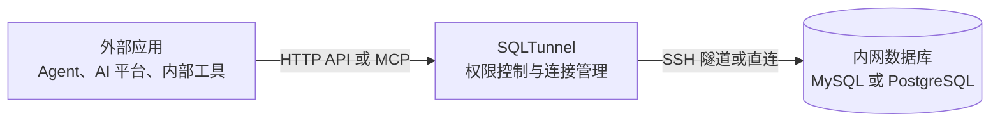

# SQLTunnel

[](https://hub.docker.com/r/nemoalex/sqltunnel)
[](https://hub.docker.com/r/nemoalex/sqltunnel/tags)

[English](README.md) | [中文](README.zh-CN.md) | [日本語](docs/readme/README.ja.md) | [한국어](docs/readme/README.ko.md) | [Français](docs/readme/README.fr.md) | [Deutsch](docs/readme/README.de.md)

SQLTunnel 是一个数据库访问网关，让 Codex、Claude Code、Hermes 等 Agent，以及 Dify、自动化平台和内部应用能够按权限查询内网数据库，而无需直接暴露数据库端口。

主要能力：

- 支持 MySQL 和 PostgreSQL，可直连或通过 SSH 隧道访问。
- 使用 API key 识别调用方，并按 client 和 db server 配置读写权限。
- 支持 SSH config、Host alias 和 ProxyJump。
- 提供 OpenAPI HTTP 接口和 Streamable HTTP MCP 接口。
- 限制查询行数和超时时间，写入操作需要显式授权。

## 工作方式



`gateway.yaml` 包含三类配置：

- `dbServers`：数据库连接信息。
- `sshServers`：可复用的 SSH 连接。
- `clients`：外部调用方及其数据库权限。

数据库密码和 SSH 私钥只保存在 SQLTunnel 服务端，外部调用方只需要自己的 API key。

## 快速开始

### 直接运行

```bash
git clone https://github.com/NemoAlex/SQLTunnel.git
cd SQLTunnel
cp config/gateway.example.yaml config/gateway.yaml
npm install
npm run build
npm run start
```

服务默认监听 `0.0.0.0:3000`，可通过环境变量修改：

```bash
FASTIFY_HOST=127.0.0.1 FASTIFY_PORT=3001 npm run start
```

### 使用 Docker 镜像

通过 Docker Compose 使用已发布的 SQLTunnel 镜像：

```yaml
services:
  sqltunnel:
    image: nemoalex/sqltunnel:1.0.2
    container_name: sqltunnel
    restart: unless-stopped
    ports:
      - "3000:3000"
    volumes:
      - ./config:/app/config:ro
```

```bash
cp config/gateway.example.yaml config/gateway.yaml
docker compose up -d
```

### 使用 Docker 本地构建

仓库内的 `compose.yaml` 会从本地源码构建 SQLTunnel 并启动服务：

```bash
docker compose up --build
```

## 配置

SQLTunnel 默认读取 `config/gateway.yaml`。先复制 `config/gateway.example.yaml`，再配置以下部分：

- `defaults`：可选的全局限制，包括最大返回行数、查询和连接超时、Schema 缓存时间。
- `sshServers`：可选的可复用 SSH 连接；数据库无法直连时，可通过 ID 引用 SSH 连接。
- `dbServers`：MySQL 或 PostgreSQL 的连接信息、可选 SSH 路由，以及数据库级限制。
- `clients`：API key、数据库访问授权、`read` 或 `write` 权限，以及可选的客户端级限制。

完整 YAML 结构、字段含义、默认值、SSH config 支持、ProxyJump 示例和权限规则，请查看 **[配置参考](docs/configuration.zh-CN.md)**。

推荐的目录结构如下：

```text
config/
  gateway.yaml
  gateway.example.yaml
  ssh/                 # 可选
    config             # 可选：SSH Host alias、用户、端口、ProxyJump 等登录信息
    id_rsa             # 可选：使用密钥登录 SSH 时需要的私钥
```

可通过 `SQLTUNNEL_CONFIG=/path/to/gateway.yaml` 从其他位置加载配置文件。相对路径形式的 `sshConfigPath` 和 `privateKeyPath` 均基于 `gateway.yaml` 所在目录解析，因此上面的结构既适用于本地运行，也适用于将整个 `config` 目录挂载到 `/app/config` 的 Docker 部署。

`gateway.yaml` 包含数据库密码、客户端 API key，并可能包含 SSH 凭据。请勿将其提交到版本控制，限制文件访问权限，并只授予每个客户端所需的数据库及 `read` 或 `write` 权限。

## OpenAPI

OpenAPI 文档位于 `GET /openapi.json`，业务接口包括：

- `POST /schema`：列出数据库、表，或读取表结构。
- `POST /query`：执行经过授权和限制的 SQL。

请求使用 `Authorization: Bearer <SQLTUNNEL_API_KEY>` 鉴权。完整格式见 [API 参考](docs/api.zh-CN.md)。

## MCP

Streamable HTTP MCP 接口位于 `POST /mcp`，提供以下工具：

- `list_db_servers`
- `list_database_tables`
- `get_table_schema`
- `query_database`

MCP 使用与 OpenAPI 相同的 API key、数据库权限、行数限制和超时配置。建议为 Agent 配置只读 client 和只读数据库账号，远程部署时通过 HTTPS 暴露 `/mcp`。

接入指南：

- [Dify](docs/dify.zh-CN.md)
- [Claude Code](docs/claude-code.zh-CN.md)
- [Codex](docs/codex.zh-CN.md)
- [Hermes](docs/hermes.zh-CN.md)

## 参考文档

- [配置参考](docs/configuration.zh-CN.md)
- [API 参考](docs/api.zh-CN.md)
