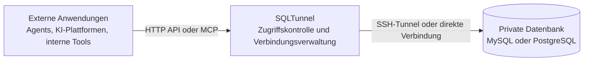

# SQLTunnel

[](https://hub.docker.com/r/nemoalex/sqltunnel)
[](https://hub.docker.com/r/nemoalex/sqltunnel/tags)

[English](../../README.md) | [中文](../../README.zh-CN.md) | [日本語](README.ja.md) | [한국어](README.ko.md) | [Français](README.fr.md) | [Deutsch](README.de.md)

SQLTunnel ist ein Datenbankzugriffs-Gateway. Es ermöglicht Agents wie Codex, Claude Code und Hermes sowie Dify, Automatisierungsplattformen und internen Anwendungen, private Datenbanken mit kontrollierten Berechtigungen abzufragen, ohne Datenbankports direkt freizugeben.

Wichtige Funktionen:

- Unterstützt MySQL und PostgreSQL über direkte Verbindungen oder SSH-Tunnel.
- Identifiziert Aufrufer über API keys und konfiguriert Lese-/Schreibrechte pro client und db server.
- Unterstützt SSH config, Host-Aliase und ProxyJump.
- Stellt eine OpenAPI HTTP API und einen Streamable HTTP MCP endpoint bereit.
- Begrenzt Zeilenanzahl und Zeitüberschreitungen; Schreibvorgänge erfordern eine ausdrückliche Berechtigung.

## Funktionsweise



`gateway.yaml` enthält drei Arten von Konfigurationen:

- `dbServers`: Verbindungsdaten der Datenbanken.
- `sshServers`: wiederverwendbare SSH-Verbindungen.
- `clients`: externe Aufrufer und ihre Datenbankberechtigungen.

Datenbankpasswörter und private SSH-Schlüssel verbleiben auf dem SQLTunnel-Server. Externe Aufrufer benötigen nur ihren eigenen API key.

## Schnellstart

### Direkt ausführen

```bash
git clone https://github.com/NemoAlex/SQLTunnel.git
cd SQLTunnel
cp config/gateway.example.yaml config/gateway.yaml
npm install
npm run build
npm run start
```

Der Dienst lauscht standardmäßig auf `0.0.0.0:3000`. Die Adresse kann über Umgebungsvariablen geändert werden:

```bash
FASTIFY_HOST=127.0.0.1 FASTIFY_PORT=3001 npm run start
```

### Docker-Image verwenden

Verwenden Sie das veröffentlichte SQLTunnel-Image mit Docker Compose:

```yaml
services:
  sqltunnel:
    image: nemoalex/sqltunnel:1.0.1
    container_name: sqltunnel
    restart: unless-stopped
    ports:
      - "3000:3000"
    volumes:
      - ./config:/app/config:ro
```

```bash
cp config/gateway.example.yaml config/gateway.yaml
docker compose up -d
```

### Docker-Image lokal bauen

Die `compose.yaml` im Repository baut SQLTunnel aus dem lokalen Quellcode und startet den Dienst:

```bash
docker compose up --build
```

## Konfiguration

SQLTunnel liest standardmäßig `config/gateway.yaml`. Kopieren Sie zunächst `config/gateway.example.yaml` und konfigurieren Sie anschließend die folgenden Bereiche:

- `defaults`: optionale globale Grenzwerte für zurückgegebene Zeilen, Abfrage- und Verbindungszeitüberschreitungen sowie die Lebensdauer des Schema-Caches.
- `sshServers`: optionale wiederverwendbare SSH-Verbindungen. Datenbankserver können sie per ID referenzieren, wenn keine direkte Verbindung möglich ist.
- `dbServers`: MySQL- oder PostgreSQL-Verbindungsdaten, optionales SSH-Routing und serverbezogene Grenzwerte.
- `clients`: API keys, Datenbankzugriffsrechte, `read`- oder `write`-Berechtigungen und optionale clientbezogene Grenzwerte.

Das vollständige YAML schema, Feldbeschreibungen, Standardwerte, unterstützte SSH-config-Optionen, ProxyJump-Beispiele und das Berechtigungsverhalten finden Sie in der **[Konfigurationsreferenz](../configuration.md)**.

Die empfohlene Verzeichnisstruktur lautet:

```text
config/
  gateway.yaml
  gateway.example.yaml
  ssh/                 # Optional
    config             # Optional: SSH Host-Aliase, Benutzer, Ports, ProxyJump und weitere Anmeldedaten
    id_rsa             # Optional: privater Schlüssel für die SSH-Anmeldung per Schlüssel
```

Setzen Sie `SQLTUNNEL_CONFIG=/path/to/gateway.yaml`, um eine Konfigurationsdatei an einem anderen Ort zu laden. Relative Werte für `sshConfigPath` und `privateKeyPath` werden ausgehend vom Verzeichnis der `gateway.yaml` aufgelöst. Daher funktioniert die obige Struktur sowohl lokal als auch in Docker, wenn das gesamte Verzeichnis `config` unter `/app/config` gemountet wird.

`gateway.yaml` enthält Datenbankpasswörter, client API keys und möglicherweise SSH-Zugangsdaten. Nehmen Sie die Datei nicht in die Versionsverwaltung auf, beschränken Sie ihre Zugriffsrechte und gewähren Sie jedem client nur Zugriff auf die benötigten Datenbanken sowie die erforderliche `read`- oder `write`-Berechtigung.

## OpenAPI

Das OpenAPI-Dokument ist unter `GET /openapi.json` verfügbar. Die fachlichen endpoints sind:

- `POST /schema`: Datenbanken oder Tabellen auflisten oder ein Tabellenschema lesen.
- `POST /query`: eine autorisierte und begrenzte SQL-Anweisung ausführen.

Anfragen werden mit `Authorization: Bearer <SQLTUNNEL_API_KEY>` authentifiziert. Vollständige Formate finden Sie in der [API-Referenz](../api.md).

## MCP

Der Streamable HTTP MCP endpoint ist unter `POST /mcp` verfügbar und stellt folgende Tools bereit:

- `list_db_servers`
- `list_database_tables`
- `get_table_schema`
- `query_database`

MCP verwendet dieselben API keys, Datenbankberechtigungen, Zeilenlimits und Zeitüberschreitungen wie OpenAPI. Verwenden Sie für Agents einen schreibgeschützten client und Datenbankbenutzer und stellen Sie `/mcp` bei entfernten Bereitstellungen über HTTPS bereit.

Einrichtungsanleitungen:

- [Dify](../dify.md)
- [Claude Code](../claude-code.md)
- [Codex](../codex.md)
- [Hermes](../hermes.md)

## Referenz

- [Konfigurationsreferenz](../configuration.md)
- [API-Referenz](../api.md)
