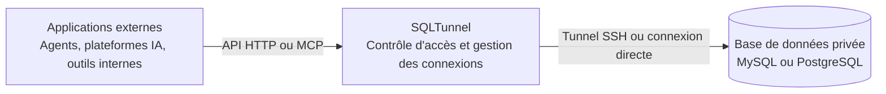

# SQLTunnel

[](https://hub.docker.com/r/nemoalex/sqltunnel)
[](https://hub.docker.com/r/nemoalex/sqltunnel/tags)

[English](../../README.md) | [中文](../../README.zh-CN.md) | [日本語](README.ja.md) | [한국어](README.ko.md) | [Français](README.fr.md) | [Deutsch](README.de.md)

SQLTunnel est une passerelle d'accès aux bases de données. Elle permet aux agents comme Codex, Claude Code et Hermes, ainsi qu'à Dify, aux plateformes d'automatisation et aux applications internes, d'interroger des bases de données privées avec des autorisations contrôlées, sans exposer directement leurs ports.

Fonctionnalités principales :

- Prend en charge MySQL et PostgreSQL, en connexion directe ou via un tunnel SSH.
- Identifie les appelants avec des clés API et configure les droits de lecture/écriture par client et db server.
- Prend en charge SSH config, les alias Host et ProxyJump.
- Fournit une API HTTP OpenAPI et un endpoint MCP Streamable HTTP.
- Limite le nombre de lignes et la durée des requêtes ; les écritures nécessitent une autorisation explicite.

## Fonctionnement



`gateway.yaml` contient trois types de configuration :

- `dbServers` : informations de connexion aux bases de données.
- `sshServers` : connexions SSH réutilisables.
- `clients` : appelants externes et leurs autorisations d'accès.

Les mots de passe des bases de données et les clés privées SSH restent sur le serveur SQLTunnel. Chaque appelant externe n'a besoin que de sa propre clé API.

## Démarrage rapide

### Exécution directe

```bash
git clone https://github.com/NemoAlex/SQLTunnel.git
cd SQLTunnel
cp config/gateway.example.yaml config/gateway.yaml
npm install
npm run build
npm run start
```

Le service écoute par défaut sur `0.0.0.0:3000`. Utilisez des variables d'environnement pour modifier cette adresse :

```bash
FASTIFY_HOST=127.0.0.1 FASTIFY_PORT=3001 npm run start
```

### Docker Compose

```yaml
services:
  sqltunnel:
    image: nemoalex/sqltunnel:1.0.0
    container_name: sqltunnel
    restart: unless-stopped
    ports:
      - "3000:3000"
    volumes:
      - ./config:/app/config:ro
```

```bash
cp config/gateway.example.yaml config/gateway.yaml
docker compose up -d
```

Le fichier `compose.yaml` du dépôt construit l'image localement :

```bash
docker compose up --build
```

## Répertoire de configuration

```text
config/
  gateway.yaml
  gateway.example.yaml
  ssh/                 # Facultatif
    config             # Facultatif : alias SSH Host, utilisateurs, ports, ProxyJump et autres informations de connexion
    id_rsa             # Facultatif : clé privée requise pour l'authentification SSH par clé
```

Copiez `config/gateway.example.yaml`, puis adaptez-le à votre environnement. Avec Docker, montez le répertoire `config` complet dans `/app/config`. Référencez les fichiers SSH avec des chemins relatifs à `gateway.yaml`, par exemple `ssh/config` ou `ssh/id_rsa`.

## OpenAPI

Le document OpenAPI est disponible sur `GET /openapi.json`. Les endpoints métier sont :

- `POST /schema` : lister les bases de données ou les tables, ou lire la structure d'une table.
- `POST /query` : exécuter une instruction SQL autorisée et limitée.

Les requêtes utilisent `Authorization: Bearer <SQLTUNNEL_API_KEY>`. Consultez la [référence API](../api.md) pour les formats complets.

## MCP

L'endpoint MCP Streamable HTTP est disponible sur `POST /mcp` et fournit les outils suivants :

- `list_db_servers`
- `list_database_tables`
- `get_table_schema`
- `query_database`

MCP utilise les mêmes clés API, autorisations de base de données, limites de lignes et délais qu'OpenAPI. Utilisez un client et un compte de base de données en lecture seule pour les agents, et exposez `/mcp` via HTTPS pour les déploiements distants.

Guides de configuration :

- [Dify](../dify.md)
- [Claude Code](../claude-code.md)
- [Codex](../codex.md)
- [Hermes](../hermes.md)

## Références

- [Référence de configuration](../configuration.md)
- [Référence API](../api.md)
