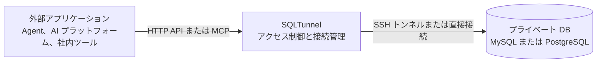

# SQLTunnel

[](https://hub.docker.com/r/nemoalex/sqltunnel)
[](https://hub.docker.com/r/nemoalex/sqltunnel/tags)

[English](../../README.md) | [中文](../../README.zh-CN.md) | [日本語](README.ja.md) | [한국어](README.ko.md) | [Français](README.fr.md) | [Deutsch](README.de.md)

SQLTunnel は、Codex、Claude Code、Hermes などの Agent に加え、Dify、自動化プラットフォーム、社内アプリケーションが、データベースポートを直接公開せずに権限管理された状態でプライベートデータベースを照会できるようにするデータベースアクセスゲートウェイです。

主な機能：

- MySQL と PostgreSQL に対応し、直接接続または SSH トンネルを利用できます。
- API key で呼び出し元を識別し、client と db server ごとに読み取り・書き込み権限を設定します。
- SSH config、Host alias、ProxyJump に対応します。
- OpenAPI HTTP API と Streamable HTTP MCP endpoint を提供します。
- 行数とタイムアウトを制限し、書き込みには明示的な権限が必要です。

## 仕組み



`gateway.yaml` には 3 種類の設定があります。

- `dbServers`：データベース接続情報。
- `sshServers`：再利用可能な SSH 接続。
- `clients`：外部の呼び出し元とデータベース権限。

データベースパスワードと SSH 秘密鍵は SQLTunnel サーバー内にのみ保存されます。外部の呼び出し元に必要なのは自身の API key だけです。

## クイックスタート

### 直接実行

```bash
git clone https://github.com/NemoAlex/SQLTunnel.git
cd SQLTunnel
cp config/gateway.example.yaml config/gateway.yaml
npm install
npm run build
npm run start
```

既定では `0.0.0.0:3000` で待ち受けます。環境変数で変更できます。

```bash
FASTIFY_HOST=127.0.0.1 FASTIFY_PORT=3001 npm run start
```

### Docker イメージを使用

公開済みの SQLTunnel イメージを Docker Compose で使用します。

```yaml
services:
  sqltunnel:
    image: nemoalex/sqltunnel:1.0.1
    container_name: sqltunnel
    restart: unless-stopped
    ports:
      - "3000:3000"
    volumes:
      - ./config:/app/config:ro
```

```bash
cp config/gateway.example.yaml config/gateway.yaml
docker compose up -d
```

### Docker イメージをローカルでビルド

リポジトリの `compose.yaml` はローカルのソースコードから SQLTunnel をビルドし、サービスを起動します。

```bash
docker compose up --build
```

## 設定

SQLTunnel は既定で `config/gateway.yaml` を読み込みます。まず `config/gateway.example.yaml` をコピーし、次のセクションを設定します。

- `defaults`：返却行数、クエリと接続のタイムアウト、Schema キャッシュ期間に関する任意のグローバル制限。
- `sshServers`：任意の再利用可能な SSH 接続。データベースへ直接接続できない場合、データベースサーバーから ID で参照できます。
- `dbServers`：MySQL または PostgreSQL の接続情報、任意の SSH ルーティング、サーバー単位の制限。
- `clients`：API key、データベースへのアクセス許可、`read` または `write` 権限、任意の client 単位の制限。

完全な YAML schema、フィールドの説明、既定値、SSH config の対応範囲、ProxyJump の例、権限の動作については、**[設定リファレンス](../configuration.md)**を参照してください。

推奨するディレクトリ構成は次のとおりです。

```text
config/
  gateway.yaml
  gateway.example.yaml
  ssh/                 # 任意
    config             # 任意：SSH Host alias、ユーザー、ポート、ProxyJump などのログイン情報
    id_rsa             # 任意：鍵認証による SSH ログインに必要な秘密鍵
```

別の場所にある設定ファイルを読み込むには、`SQLTUNNEL_CONFIG=/path/to/gateway.yaml` を指定します。相対パスの `sshConfigPath` と `privateKeyPath` は `gateway.yaml` があるディレクトリを基準に解決されるため、上記の構成はローカル実行にも、`config` ディレクトリ全体を `/app/config` にマウントする Docker 環境にも利用できます。

`gateway.yaml` にはデータベースパスワード、client API key、場合によっては SSH 認証情報が含まれます。バージョン管理には追加せず、ファイルのアクセス権を制限し、各 client には必要なデータベースと `read` または `write` 権限だけを付与してください。

## OpenAPI

OpenAPI ドキュメントは `GET /openapi.json` で取得できます。業務 endpoint は次のとおりです。

- `POST /schema`：データベースやテーブルの一覧、またはテーブル構造を取得します。
- `POST /query`：承認と制限が適用された SQL 文を実行します。

リクエストは `Authorization: Bearer <SQLTUNNEL_API_KEY>` で認証します。完全な形式は [API リファレンス](../api.md) を参照してください。

## MCP

Streamable HTTP MCP endpoint は `POST /mcp` で提供され、次のツールを利用できます。

- `list_db_servers`
- `list_database_tables`
- `get_table_schema`
- `query_database`

MCP は OpenAPI と同じ API key、データベース権限、行数制限、タイムアウトを使用します。Agent には読み取り専用の client とデータベースアカウントを使用し、リモート環境では `/mcp` を HTTPS で公開してください。

セットアップガイド：

- [Dify](../dify.md)
- [Claude Code](../claude-code.md)
- [Codex](../codex.md)
- [Hermes](../hermes.md)

## リファレンス

- [設定リファレンス](../configuration.md)
- [API リファレンス](../api.md)
