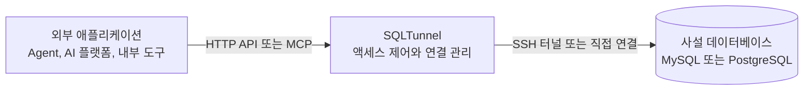

# SQLTunnel

[](https://hub.docker.com/r/nemoalex/sqltunnel)
[](https://hub.docker.com/r/nemoalex/sqltunnel/tags)

[English](../../README.md) | [中文](../../README.zh-CN.md) | [日本語](README.ja.md) | [한국어](README.ko.md) | [Français](README.fr.md) | [Deutsch](README.de.md)

SQLTunnel은 Codex, Claude Code, Hermes 같은 Agent와 Dify, 자동화 플랫폼, 내부 애플리케이션이 데이터베이스 포트를 직접 노출하지 않고도 권한에 따라 사설 데이터베이스를 조회할 수 있게 하는 데이터베이스 액세스 게이트웨이입니다.

주요 기능:

- MySQL과 PostgreSQL을 지원하며 직접 연결하거나 SSH 터널을 사용할 수 있습니다.
- API key로 호출자를 식별하고 client와 db server별로 읽기/쓰기 권한을 설정합니다.
- SSH config, Host alias, ProxyJump를 지원합니다.
- OpenAPI HTTP API와 Streamable HTTP MCP endpoint를 제공합니다.
- 행 수와 제한 시간을 제한하며 쓰기에는 명시적인 권한이 필요합니다.

## 동작 방식



`gateway.yaml`에는 세 가지 유형의 설정이 있습니다.

- `dbServers`: 데이터베이스 연결 정보.
- `sshServers`: 재사용 가능한 SSH 연결.
- `clients`: 외부 호출자와 데이터베이스 권한.

데이터베이스 비밀번호와 SSH 개인 키는 SQLTunnel 서버에만 저장됩니다. 외부 호출자에게는 자신의 API key만 필요합니다.

## 빠른 시작

### 직접 실행

```bash
git clone https://github.com/NemoAlex/SQLTunnel.git
cd SQLTunnel
cp config/gateway.example.yaml config/gateway.yaml
npm install
npm run build
npm run start
```

기본적으로 `0.0.0.0:3000`에서 수신합니다. 환경 변수로 변경할 수 있습니다.

```bash
FASTIFY_HOST=127.0.0.1 FASTIFY_PORT=3001 npm run start
```

### Docker 이미지 사용

Docker Compose로 배포된 SQLTunnel 이미지를 사용합니다.

```yaml
services:
  sqltunnel:
    image: nemoalex/sqltunnel:1.0.1
    container_name: sqltunnel
    restart: unless-stopped
    ports:
      - "3000:3000"
    volumes:
      - ./config:/app/config:ro
```

```bash
cp config/gateway.example.yaml config/gateway.yaml
docker compose up -d
```

### Docker 이미지 로컬 빌드

저장소의 `compose.yaml`은 로컬 소스 코드에서 SQLTunnel을 빌드하고 서비스를 시작합니다.

```bash
docker compose up --build
```

## 구성

SQLTunnel은 기본적으로 `config/gateway.yaml`을 읽습니다. 먼저 `config/gateway.example.yaml`을 복사한 후 다음 섹션을 구성하세요.

- `defaults`: 반환 행 수, 쿼리 및 연결 제한 시간, Schema 캐시 수명에 대한 선택적 전역 제한입니다.
- `sshServers`: 선택적으로 재사용할 수 있는 SSH 연결입니다. 데이터베이스에 직접 연결할 수 없을 때 데이터베이스 서버가 ID로 참조할 수 있습니다.
- `dbServers`: MySQL 또는 PostgreSQL 연결 정보, 선택적 SSH 라우팅 및 서버 수준 제한입니다.
- `clients`: API key, 데이터베이스 접근 권한, `read` 또는 `write` 권한 및 선택적 client 수준 제한입니다.

전체 YAML schema, 필드 설명, 기본값, SSH config 지원, ProxyJump 예제 및 권한 동작은 **[구성 참조](../configuration.md)**를 확인하세요.

권장 디렉터리 구조는 다음과 같습니다.

```text
config/
  gateway.yaml
  gateway.example.yaml
  ssh/                 # 선택 사항
    config             # 선택 사항: SSH Host alias, 사용자, 포트, ProxyJump 등의 로그인 정보
    id_rsa             # 선택 사항: 키 기반 SSH 로그인에 필요한 개인 키
```

다른 위치의 구성 파일을 불러오려면 `SQLTUNNEL_CONFIG=/path/to/gateway.yaml`을 설정하세요. 상대 경로로 지정한 `sshConfigPath`와 `privateKeyPath`는 `gateway.yaml`이 있는 디렉터리를 기준으로 해석되므로, 위 구조는 로컬 실행과 전체 `config` 디렉터리를 `/app/config`에 마운트하는 Docker 배포 모두에서 사용할 수 있습니다.

`gateway.yaml`에는 데이터베이스 비밀번호, client API key 및 SSH 자격 증명이 포함될 수 있습니다. 버전 관리에 커밋하지 말고 파일 접근 권한을 제한하며, 각 client에는 필요한 데이터베이스와 `read` 또는 `write` 권한만 부여하세요.

## OpenAPI

OpenAPI 문서는 `GET /openapi.json`에서 제공됩니다. 업무 endpoint는 다음과 같습니다.

- `POST /schema`: 데이터베이스나 테이블 목록 또는 테이블 구조를 조회합니다.
- `POST /query`: 권한과 제한이 적용된 SQL 문을 실행합니다.

요청은 `Authorization: Bearer <SQLTUNNEL_API_KEY>`로 인증합니다. 전체 형식은 [API 참조](../api.md)를 확인하세요.

## MCP

Streamable HTTP MCP endpoint는 `POST /mcp`에서 제공되며 다음 도구를 포함합니다.

- `list_db_servers`
- `list_database_tables`
- `get_table_schema`
- `query_database`

MCP는 OpenAPI와 동일한 API key, 데이터베이스 권한, 행 수 제한, 제한 시간을 사용합니다. Agent에는 읽기 전용 client와 데이터베이스 계정을 사용하고 원격 배포에서는 `/mcp`를 HTTPS로 노출하세요.

설정 가이드:

- [Dify](../dify.md)
- [Claude Code](../claude-code.md)
- [Codex](../codex.md)
- [Hermes](../hermes.md)

## 참조 문서

- [설정 참조](../configuration.md)
- [API 참조](../api.md)
