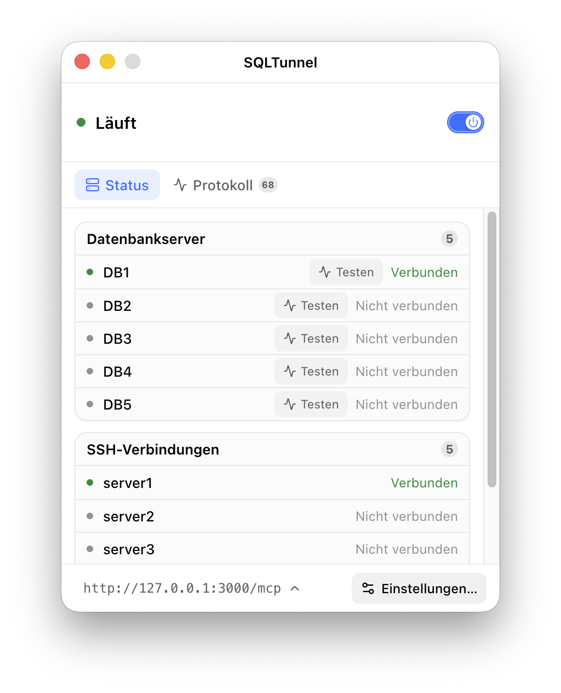
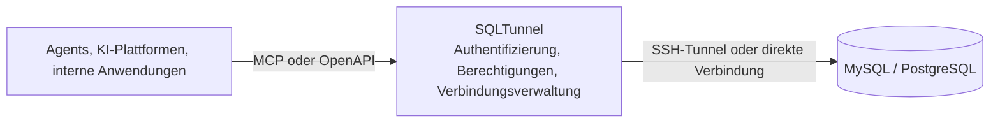

  

<h1 align="center">SQLTunnel</h1>

<strong>Ein zugriffsgesteuertes Datenbank-Gateway für Agents, Automatisierungsplattformen und interne Anwendungen</strong>

  
  

  <a href="../../../README.md">English</a> |
  <a href="../zh-CN/README.md">中文</a> |
  <a href="../ja/README.md">日本語</a> |
  <a href="../ko/README.md">한국어</a> |
  <a href="../fr/README.md">Français</a> |
  <a href="README.md">Deutsch</a>

SQLTunnel ermöglicht Codex, Claude Code, Hermes, Dify und internen Anwendungen den kontrollierten Zugriff auf MySQL und PostgreSQL, ohne Datenbankports direkt freizugeben.

## Wichtige Funktionen

- Unterstützt MySQL und PostgreSQL über direkte Verbindungen oder SSH-Tunnel.
- Identifiziert Aufrufer über API-Schlüssel und konfiguriert Lese-/Schreibrechte pro Client und Datenbank.
- Unterstützt SSH Config, Host-Aliase und ProxyJump.
- Stellt eine OpenAPI-HTTP-API und einen Streamable-HTTP-MCP-Endpunkt bereit.
- Begrenzt Zeilenanzahl und Zeitüberschreitungen; Schreibvorgänge erfordern eine ausdrückliche Berechtigung.

## Desktop-Version

Die Desktop-Version unterstützt macOS und Windows und bündelt Konfiguration, Betrieb und Überwachung von SQLTunnel in einer grafischen Oberfläche.

  

## Headless-Dienst

Die Headless-Version verwendet denselben Gateway-Kern und eignet sich für Docker, Server und Hintergrundbereitstellungen. Sie verwaltet Datenbanken, SSH-Tunnel und Client-Berechtigungen über `gateway.yaml` und stellt dieselben MCP/OpenAPI-Schnittstellen wie die Desktop-Version bereit.

- [Docker-Bereitstellung](docker.md)
- [Konfigurationsreferenz](configuration.md)

## Funktionsweise

SQLTunnel identifiziert Aufrufer über Bearer-API-Schlüssel, kontrolliert Lese-/Schreibrechte pro Client und Datenbank und wendet Zeilen-, Abfrage- und Verbindungslimits an. Datenbankpasswörter und private SSH-Schlüssel werden Aufrufern niemals offengelegt.

## Dokumentation

- [Docker-Bereitstellung](docker.md)
- [Konfigurationsreferenz](configuration.md)
- [API-Referenz](api.md)
- [Dify](dify.md)
- [Claude Code](claude-code.md)
- [Codex](codex.md)
- [Hermes](hermes.md)
