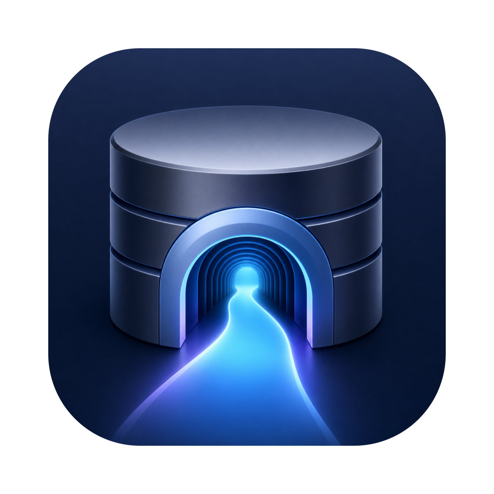
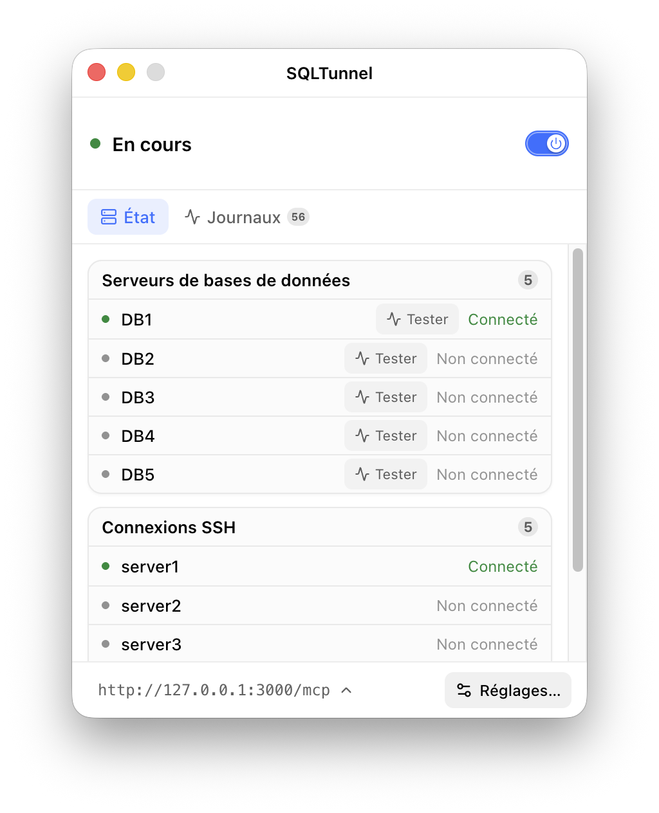
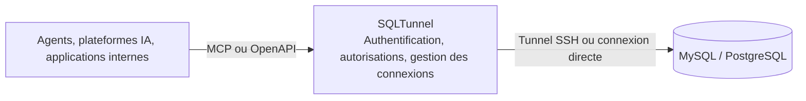

  

<h1 align="center">SQLTunnel</h1>

<strong>Une passerelle de base de données à accès contrôlé pour les agents, les plateformes d’automatisation et les applications internes</strong>

  
  

  <a href="../en/README.md">English</a> |
  <a href="../zh-CN/README.md">中文</a> |
  <a href="../ja/README.md">日本語</a> |
  <a href="../ko/README.md">한국어</a> |
  <a href="README.md">Français</a> |
  <a href="../de/README.md">Deutsch</a>

SQLTunnel permet à Codex, Claude Code, Hermes, Dify et aux applications internes d’accéder à MySQL et PostgreSQL avec des autorisations contrôlées, sans exposer directement les ports des bases de données.

## Fonctionnalités principales

- Prend en charge MySQL et PostgreSQL, en connexion directe ou via un tunnel SSH.
- Identifie les appelants avec des clés API et configure les droits de lecture/écriture par client et base de données.
- Prend en charge SSH Config, les alias Host et ProxyJump.
- Fournit une API HTTP OpenAPI et un point de terminaison MCP Streamable HTTP.
- Limite le nombre de lignes et la durée des requêtes ; les écritures nécessitent une autorisation explicite.

## Version de bureau

La version de bureau prend en charge macOS et Windows et rassemble la configuration, l’exécution et la surveillance de SQLTunnel dans une interface graphique.

  

## Service sans interface

La version sans interface utilise le même cœur de passerelle et convient à Docker, aux serveurs et aux déploiements en arrière-plan. Elle gère les bases de données, les tunnels SSH et les autorisations client via `gateway.yaml`, et expose les mêmes interfaces MCP/OpenAPI que la version de bureau.

- [Déploiement Docker](docker.md)
- [Référence de configuration](configuration.md)

## Fonctionnement

SQLTunnel identifie les appelants avec des clés API Bearer, contrôle les droits de lecture/écriture par client et base de données, et applique des limites de lignes, de requêtes et de connexions. Les mots de passe des bases de données et les clés privées SSH ne sont jamais exposés aux appelants.

## Documentation

- [Déploiement Docker](docker.md)
- [Référence de configuration](configuration.md)
- [Référence API](api.md)
- [Dify](dify.md)
- [Claude Code](claude-code.md)
- [Codex](codex.md)
- [Hermes](hermes.md)
