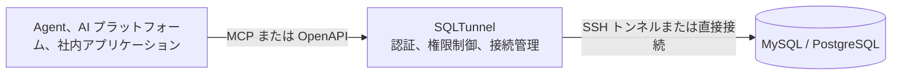

  

<h1 align="center">SQLTunnel</h1>

<strong>Agent、自動化プラットフォーム、社内アプリケーション向けのアクセス制御されたデータベースゲートウェイ</strong>

  
  

  <a href="../en/README.md">English</a> |
  <a href="../zh-CN/README.md">中文</a> |
  <a href="README.md">日本語</a> |
  <a href="../ko/README.md">한국어</a> |
  <a href="../fr/README.md">Français</a> |
  <a href="../de/README.md">Deutsch</a>

SQLTunnel により、Codex、Claude Code、Hermes、Dify、社内アプリケーションは、データベースポートを直接公開せず、権限に基づいて MySQL と PostgreSQL にアクセスできます。

## 主な機能

- MySQL と PostgreSQL に対応し、直接接続または SSH トンネルを利用できます。
- API キーで呼び出し元を識別し、クライアントとデータベースごとに読み取り・書き込み権限を設定します。
- SSH Config、Host Alias、ProxyJump に対応します。
- OpenAPI HTTP API と Streamable HTTP MCP エンドポイントを提供します。
- 行数とタイムアウトを制限し、書き込みには明示的な権限が必要です。

## デスクトップ版

デスクトップ版は macOS と Windows に対応し、SQLTunnel の設定、実行、監視をグラフィカルな画面にまとめます。

<!-- 日本語の初期設定を表示した macOS ネイティブウィンドウのスクリーンショットをここに配置します。 -->

## ヘッドレスサービス版

ヘッドレス版は同じゲートウェイコアを使用し、Docker、サーバー、バックグラウンド運用向けです。`gateway.yaml` でデータベース、SSH トンネル、クライアント権限を管理し、デスクトップ版と同じ MCP/OpenAPI インターフェースを提供します。

- [Docker デプロイ](docker.md)
- [設定リファレンス](configuration.md)

## 仕組み

SQLTunnel は Bearer API キーで呼び出し元を識別し、クライアントとデータベースごとに読み取り・書き込み権限を制御し、行数、クエリ時間、接続時間の制限を適用します。データベースパスワードと SSH 秘密鍵が呼び出し元に公開されることはありません。

## ドキュメント

- [Docker デプロイ](docker.md)
- [設定リファレンス](configuration.md)
- [API リファレンス](api.md)
- [Dify](dify.md)
- [Claude Code](claude-code.md)
- [Codex](codex.md)
- [Hermes](hermes.md)
