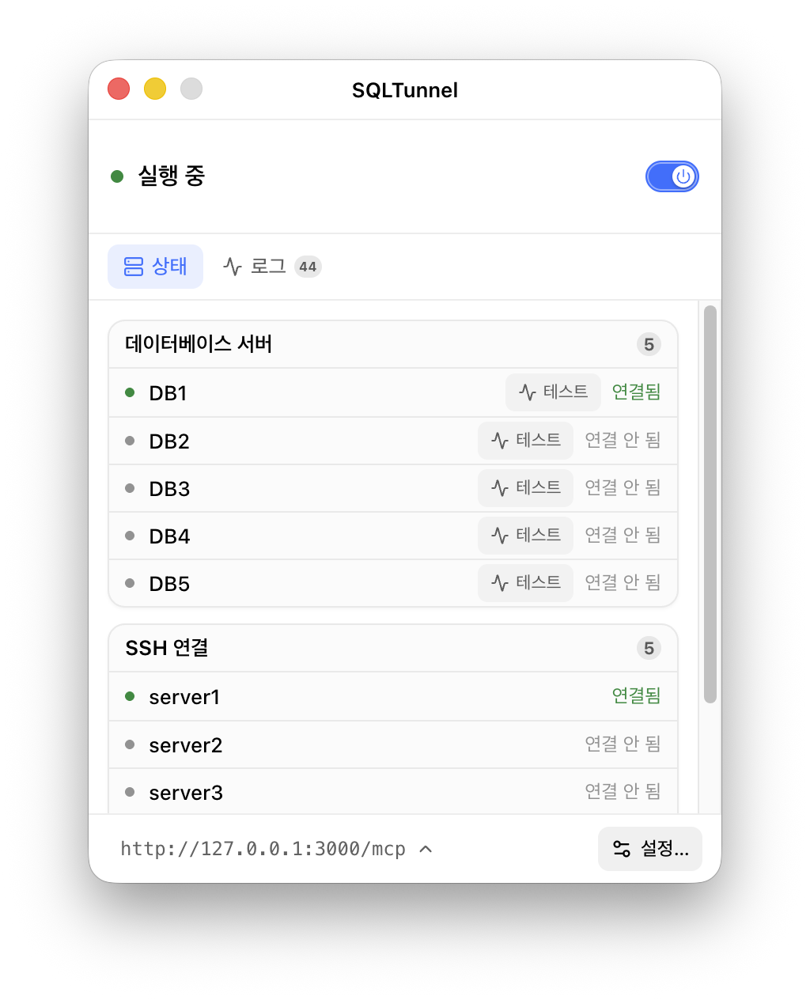
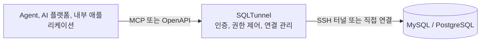

  

<h1 align="center">SQLTunnel</h1>

<strong>Agent, 자동화 플랫폼 및 내부 애플리케이션을 위한 권한 제어 데이터베이스 게이트웨이</strong>

  
  

  <a href="../../../README.md">English</a> |
  <a href="../zh-CN/README.md">中文</a> |
  <a href="../ja/README.md">日本語</a> |
  <a href="README.md">한국어</a> |
  <a href="../fr/README.md">Français</a> |
  <a href="../de/README.md">Deutsch</a>

SQLTunnel을 사용하면 Codex, Claude Code, Hermes, Dify 및 내부 애플리케이션이 데이터베이스 포트를 직접 노출하지 않고 권한에 따라 MySQL과 PostgreSQL에 접근할 수 있습니다.

## 주요 기능

- MySQL과 PostgreSQL을 지원하며 직접 연결하거나 SSH 터널을 사용할 수 있습니다.
- API 키로 호출자를 식별하고 클라이언트와 데이터베이스별로 읽기/쓰기 권한을 설정합니다.
- SSH Config, Host Alias, ProxyJump를 지원합니다.
- OpenAPI HTTP API와 Streamable HTTP MCP 엔드포인트를 제공합니다.
- 반환 행 수와 쿼리 제한 시간을 적용하며 쓰기에는 명시적인 권한이 필요합니다.

## 데스크톱 버전

데스크톱 버전은 macOS와 Windows를 지원하며 SQLTunnel의 구성, 실행 및 모니터링을 하나의 그래픽 인터페이스로 제공합니다.

  

## 헤드리스 서비스

헤드리스 버전은 동일한 게이트웨이 코어를 사용하며 Docker, 서버 및 백그라운드 배포에 적합합니다. `gateway.yaml`로 데이터베이스, SSH 터널, 클라이언트 권한을 관리하고 데스크톱 버전과 동일한 MCP/OpenAPI 인터페이스를 제공합니다.

- [Docker 배포](docker.md)
- [구성 참조](configuration.md)

## 동작 방식

SQLTunnel은 Bearer API 키로 호출자를 식별하고 클라이언트와 데이터베이스별로 읽기/쓰기 권한을 제어하며 행 수, 쿼리 및 연결 제한을 적용합니다. 데이터베이스 비밀번호와 SSH 개인 키는 호출자에게 노출되지 않습니다.

## 문서

- [Docker 배포](docker.md)
- [구성 참조](configuration.md)
- [API 참조](api.md)
- [Dify](dify.md)
- [Claude Code](claude-code.md)
- [Codex](codex.md)
- [Hermes](hermes.md)
