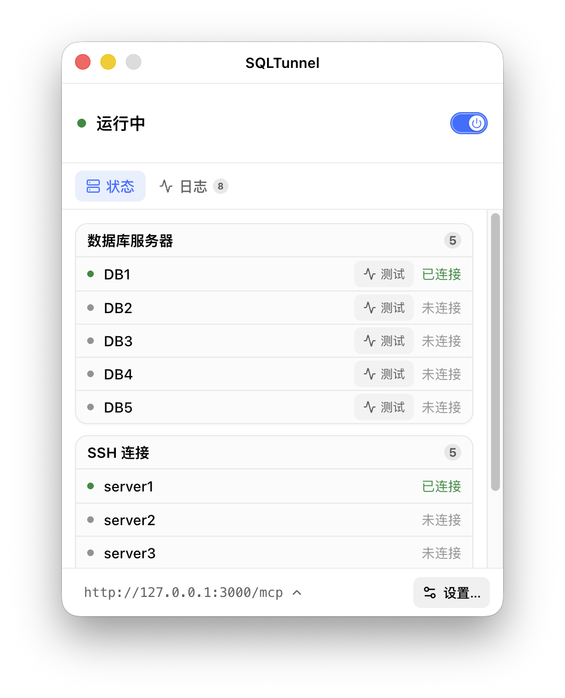
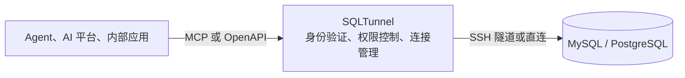

  

<h1 align="center">SQLTunnel</h1>

<strong>面向 Agent、自动化平台与内部应用的可控数据库访问网关</strong>

  
  

  <a href="../en/README.md">English</a> |
  <a href="README.md">中文</a> |
  <a href="../ja/README.md">日本語</a> |
  <a href="../ko/README.md">한국어</a> |
  <a href="../fr/README.md">Français</a> |
  <a href="../de/README.md">Deutsch</a>

SQLTunnel 让 Codex、Claude Code、Hermes、Dify 及内部应用按权限访问 MySQL 和 PostgreSQL，无需直接暴露数据库端口。

## 主要能力

- 支持 MySQL 和 PostgreSQL，可直连或通过 SSH 隧道访问。
- 使用 API Key 识别调用方，并按客户端和数据库配置读写权限。
- 支持 SSH Config、Host Alias 和 ProxyJump。
- 提供 OpenAPI HTTP 接口和 Streamable HTTP MCP 接口。
- 限制查询行数和超时时间，写入操作需要显式授权。

## 桌面版

桌面版目前支持 macOS 与 Windows，把 SQLTunnel 的配置、运行和监控集中到图形界面中。

  

## 无界面服务版

无界面版使用同一套网关核心，适合 Docker、服务器和后台常驻部署。它通过 `gateway.yaml` 管理数据库、SSH 隧道和客户端权限，并提供与桌面版相同的 MCP/OpenAPI 接口。

- [Docker 部署](docker.md)
- [配置参考](configuration.md)

## 工作方式

SQLTunnel 使用 Bearer API Key 识别调用方，按客户端和数据库控制读写权限，并统一限制返回行数、查询时间和连接时间。数据库密码与 SSH 私钥不会暴露给调用方。

## 文档

- [Docker 部署](docker.md)
- [配置参考](configuration.md)
- [API 参考](api.md)
- [Dify](dify.md)
- [Claude Code](claude-code.md)
- [Codex](codex.md)
- [Hermes](hermes.md)
